Я постарался расписать всё максимально подробно, но если вопросы всё же вознинут, пишите мне и я с радостью помогу :)

**Настоятельно прошу** полностью прочитать секцию "Важно знать", когда закончите установку. Спасибо.

## Android / iOS 📱

1. Скачайте приложение Happ из Google Play или App Store: [Google Play](https://play.google.com/store/apps/details?id=com.happproxy), [App Store](https://apps.apple.com/ru/app/happ-proxy-utility-plus/id6746188973)
2. Скопируйте ссылку которую я Вам дал
3. Нажмите на плюсик в верхнем правом углу и выберите "Импорт из буфера обмена" (см. скриншот 1)

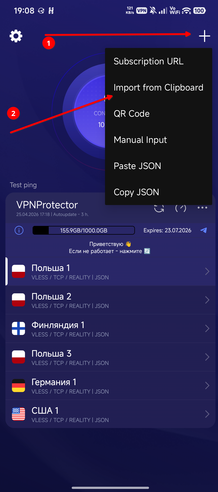

Вы увидите список серверов и сможете использовать любой из них. Для этого нажмите на сервер в списке чтобы его выбрать и нажмите кнопку "Подключиться" сверху.  
Подробнее о том как выбрать самый быстрый сервер читайте в разделе "Важно знать".

---

## Windows 💻

1. Скачайте программу Throne с GitHub: [throneproj/Throne](https://github.com/throneproj/Throne/releases/latest). На странице релиза Вам нужно выбрать и скачать файл с названием "Throne-версия-windows64-installer.exe" в разделе "Assets". (см. скриншот 2 и 2-2)

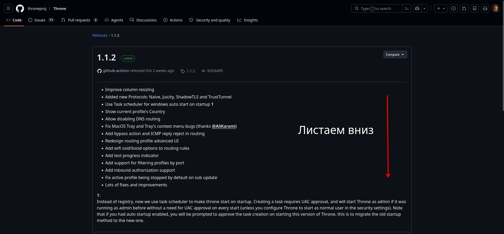
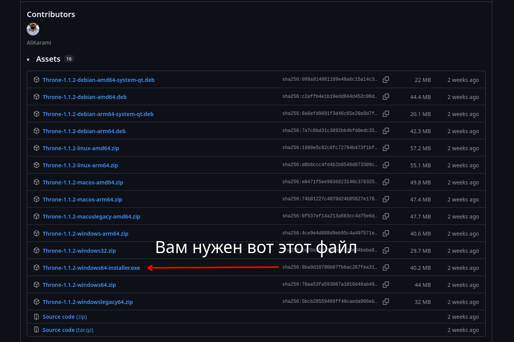

2. Откройте папку "Загрузки" и найдите только что скачанный файл. Откройте его и ответьте "Да" на все вопросы недоЗащитника Windows.
3. Несколько раз нажмите "Далее" и дождитесь завершения установки.
4. Откройте программу, она должна появиться в меню Пуск
5. Скопируйте ссылку которую я Вам дал
6. Нажмите правой кнопкой мыши в пустой список серверов и нажмите "Добавить из буфера обмена" (см. скриншот 3)
7. В открывшемся окне в выпадающем списке выберите "Create new subscription group" (см. скриншот 3-2)
8. Сверху под кнопками у вас появится вкладка с названием в виде домена подписки (или иным, если вы его задали на этапе создания группы). Зайдите туда (см. скриншот 3-3)
9. Нажмите на самом верху справа от кнопок галочку "Tun Mode" (см. скриншот 3-4)

Перед Вами список серверов. Вы можете использовать любой из них.  
Чтобы подключиться к серверу, нажмите на него правой кнопкой мыши и выберите "Start" (см. скриншот 3-5)  
Подробнее о том как выбрать самый быстрый сервер читайте в разделе "Важно знать".

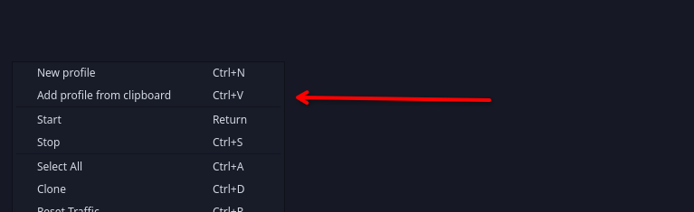
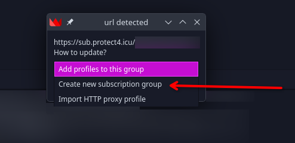
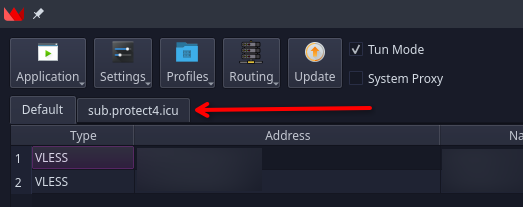
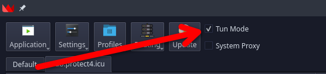
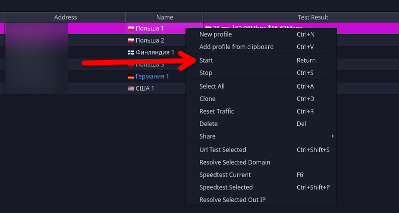

---

## LINUX 🐧❤️

1. Скачайте программу Throne с GitHub: [throneproj/Throne](https://github.com/throneproj/Throne/releases/latest). На странице релиза Вам нужно выбрать и скачать файл для вашего дистрибутива в разделе Assets:

- Debian: "Throne-версия-debian-amd64.deb".
- Другие дистрибутивы: "Throne-версия-linux-amd64.zip" (распакуйте архив и запустите бинарник. При желании напишите .desktop файл)

2. См. инструкцию для Windows, пункты 4-\*, всё должно быть плюс минус так же.

---

## Важно знать!

**Настоятельно прошу** прочитать эту секцию целиком. Это поможет Вам знать что делать в различных ситуациях и в целом получить лучший опыт использования VPN.

### ПАМАГИТЕ НЕ РАБОТАЕТ ААААААА

Без паники. Вот что нужно сделать если VPN вдруг перестал работать:  
Для начала выключите его и убедитесь что у Вас вообще работает интернет, и проблема в VPN, а не в нём.

0. Обновите подписку (см. "Как обновить подписку (и что это вообще значит)") чтобы получить последние версии конфигураций.
1. Зайдите в клиент (Happ / Throne) и повторно проверьте задержку серверов. (см. "Как выбрать лучший сервер"). Иногда по тем или иным причинам отдельные сервера временно перестают работать, именно поэтому их несколько.
2. Если подписка не обновляется, ни один сервер не отвечает при проверке задержки, или задержка низкая но ничего всё равно не работает, попробуйте включить режим полёта на минуту-другую. Я, честно, без понятия как, но это часто решает проблему с подключением.
3. Попробуйте подключиться к Wi-Fi (убедитесь что он работает). Если с Wi-Fi всё работает, а на мобильном интернете нет - мне очень жаль, но сделать ничего не выйдет. Это называется "белые списки", но они как правило временные. Держитесь!

Если ничего из этого не помогло, и Вы уверены что белых списков сейчас нет, свяжитесь со мной, и я постараюсь Вам помочь.

### Как обновить подписку (и что это вообще значит)

Немного теории.  
Подписка это та ссылка которую я вам дал. Она сама по себе не является VPN сервером, а просто предоставляет Вашему клиенту СПИСОК доступных серверов и конфигурации к ним. Нужно это для того чтобы доступно всегда было несколько серверов, тогда, если один отажет, Вы не останетесь без VPN. Так как конфигурации имеют свойство меняться, подписку нужно периодически обновлять, то есть снова запрашивать у неё список серверов.  
Вот как это сделать:

#### Happ

Нажмите кнопку обновления рядом с названием подписки (см. скриншот 4)

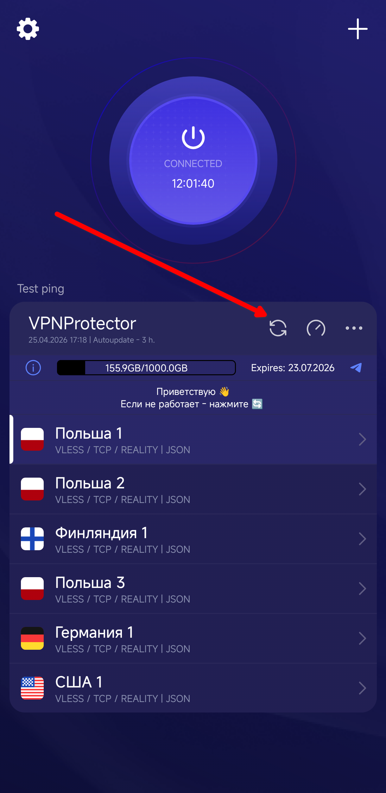

#### Throne

Нажмите правой кнопкой мыши на вкладку с подпиской и выберите "Update subscription" (см. скриншот 5)

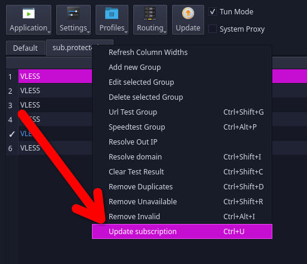

### Как выбрать лучший сервер

Так как серверов в подписке несколько, для получения максимальной скорости всегда имеет смысл выбрать тот который сейчас менее загружен и имеет меньшую задержку. Вот как это сделать:

0. Обновите подписку (см. "Как обновить подписку (и что это вообще значит)") чтобы получить последние версии конфигураций.

> По моему личному опыту (написано на момент 25.04.2026) лучше всего работает сервер Германия 1. Всегда низкая задержка в районе 60 мс и высокая скорость скачивания/загрузки. Я даже в игры с него могу играть. Если сомневаетесь, попробуйте его.

#### Happ

Нажмите на кнопку проверки задержки рядом с названием подписки, справа от кнопки обновления подписки. (см. скриншот 6)  
Дождитесь появления результатов проверки рядом с каждым сервером. Обычно это занимает не более 30 секунд. (см. скриншот 6-2)  
Чем появившееся значение задерки _меньше, тем лучше_. Если написано н/а, значит сервер не ответил вовсе.  
Подключитесь к серверу с минимальным значением задержки.

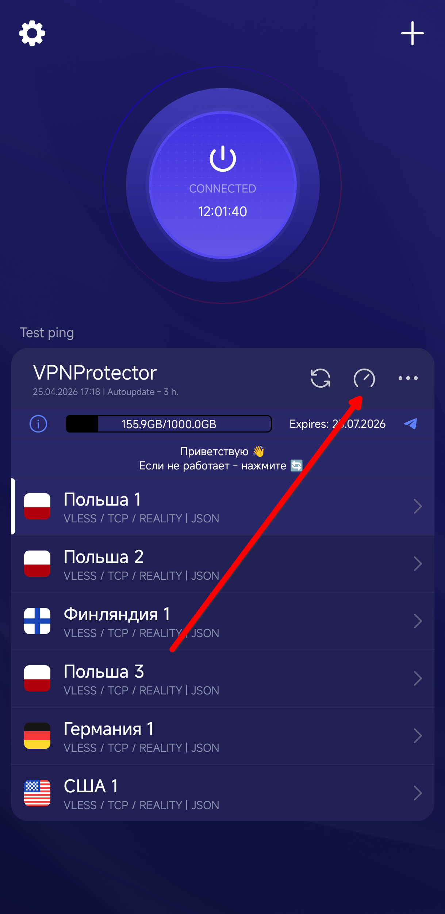
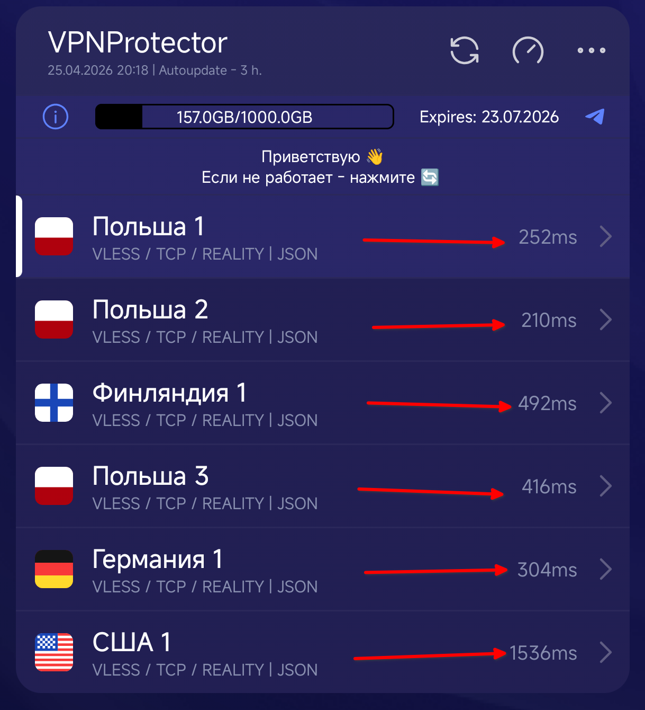

#### Throne

Throne в целом предоставляет больше функционала проверки скорости сервера чем Happ: здесь можно проверить не только задержку, но и непосредственно скорость передачи данных через сервер. Обычно эти значения коррелируют.  
Нажмите правой кнопкой мыши на вкладку с подпиской и нажите "Speedtest group". ("URL Test" проверяет только задержку). (см. скриншот 7)  
Дождитесь завершения проверки. Обычно это занимает не более минуты.  
По завершении проверки, в колонке "Test Result" появятся результаты для каждого сервера в формате "[задержка]мс [скорость-скачивания]Mbps [скорость-загрузки]Mbps". (см. скриншот 7-2).  
Если написано "Unavailable", значит сервер вовсе не ответил на запрос или к нему не удалось подключиться по той или иной причине.  
Важно: чем значение задерки МЕНЬШЕ и скорости ВЫШЕ, тем лучше.  
Выберите и подключитесь к серверу с наилучшими для Вас значениями.

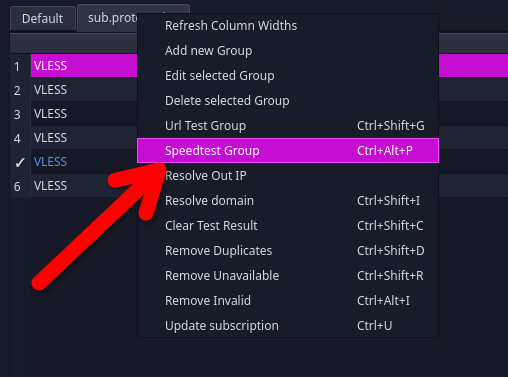
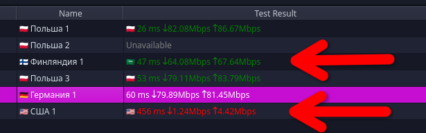

### НОВОЕ: Обход блокировок российских приложений (и сайтов) с включенным VPN

**Важно!**
Всё что описано ниже сделать **обязательно**. Не только для вашего удобства, а главным образом потому что если вы случайно зайдёте в российское приложение с ВКЛЮЧЕННЫМ VPN и при этом не сделаете описанные ниже настройки, IP адрес сервера отправится прямо в РКН на блокировку, что не есть хорошо. Благодарю за понимание.

С недавнего времени российские сервисы начали блокировать доступ если они обнаруживают включенный VPN.  
Хорошая новость состоит в том, что это легко обойти. Happ позволяет настроить обход для отдельных приложений, а Throne и вовсе имеет встроенный пресет роутинга "Bypass Russia" (и это не говоря про глубокую интеграцию в iptables и распознование процессов пакетов через netlink)

#### Happ

1. Зайдите в настройки (шестерёнка в верхнем левом углу) (надеюсь тут-то не нужен скриншот?)
2. Зайдите в раздел "Per-app Proxy Settings" (см. скриншот 8)
3. Сверху выберите "Bypass" - это позволит выбрать те приложения трафик которых будет идти В ОБХОД VPN (см. скриншот 8-2)
4. Снизу в списке приложений поставьте галочку на те, трафик которых вы не хотите пускать через VPN. Пример: MAX, МЭШ, Госуслуги (см. скриншот 8-2)

Готово, теперь вы можете вообще не выключать VPN!

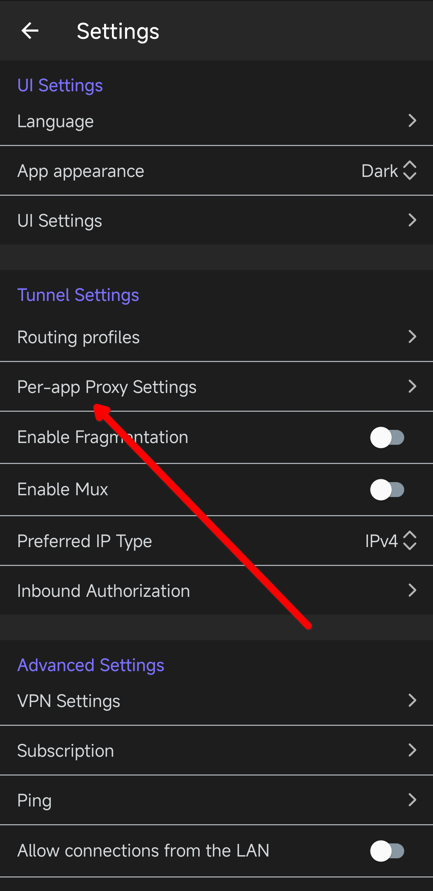
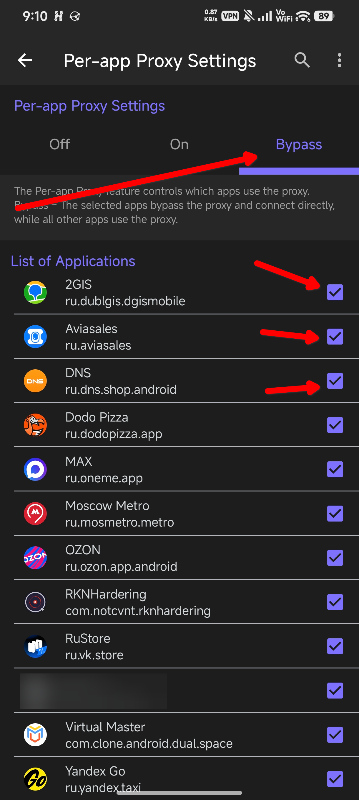

#### Throne

1. Нажмите сверху кнопку "Routing" -> "Download Profiles" -> "Bypass_Russia" (см. скриншот 9)
2. Нажмите сверху кнопку "Routing" -> поставьте галочку "Bypass_Russia" (см. скриншот 9)

Готово! Теперь ВЕСЬ ваш трафик, независимо от того из какого он приложения, не будет проксирован если он идёт к российскому домену!

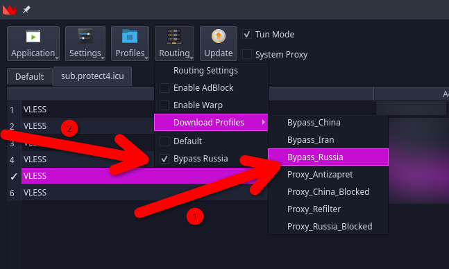

---

Огромное спасибо всем кто дочитал инструкцию до конца!
Если Вы это видите, напишите мне "YLSG". Так я смогу понять что вы действительно прочитали инструкцию, так как это необходимо для избежания проблем и мне, и вам.

\:) <!--Превращается почему-то в смайлик без \-->

---

&copy; Shukolza, 2026
ILSG
